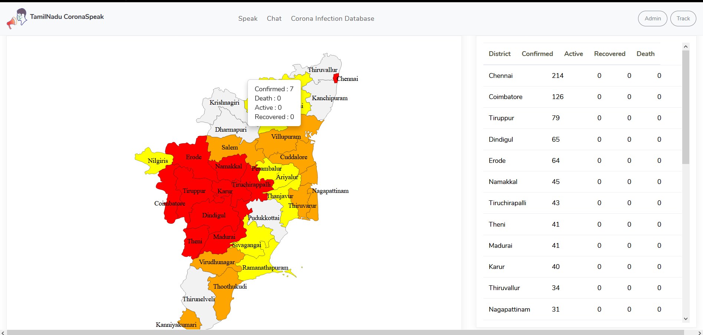
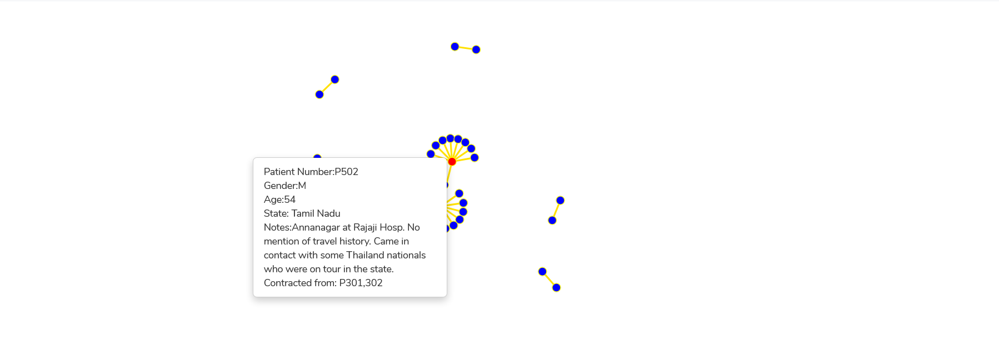

# TNCorona

Visualizing TN daily district-wise COVID-19 cases.

## Usage instructions
Just clone the repository.
```
$: git clone https://github.com/Vikr-182/TNCorona
```
Open intro.php in a web browser.

## Real Time District-Wise Map
We display the following information for each district -

- Confirmed Cases
- Recovered Cases
- Active Cases
- Death Cases



Along with this, a table for all districts is also provided showing cases for each district.

### Network Graph of spread
We also visualize the spread of virus in the state using a network flow graph, with each node representing patient and it's status.



### Data Sources
The following data sources were used - 

- District-Wise Data: https://tnstopcorona.in
- To get patient database: https://api.covid19india.org/
